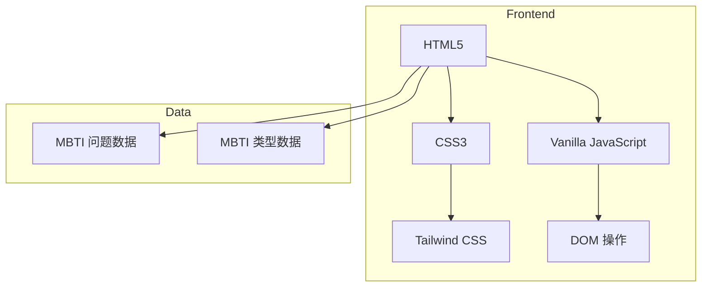

## 1. Architecture Design


## 2. Technology Description
- 前端：纯 HTML5 + CSS3 + 原生 JavaScript (无框架)
- 样式：Tailwind CSS CDN (简化开发)
- 动画：CSS 关键帧动画 + JavaScript 控制
- 构建：无需构建工具，直接部署 HTML 文件

## 3. Route Definitions
| Route | Purpose |
|-------|---------|
| /index.html | 单页面应用，通过状态管理显示不同视图 |

## 4. Core Data Structures

### 4.1 MBTI 问题数据
```typescript
interface Question {
  id: number;
  text: string;
  options: {
    text: string;
    dimension: 'EI' | 'SN' | 'TF' | 'JP';
    value: number; // +1 或 -1
  }[];
}
```

### 4.2 MBTI 类型数据
```typescript
interface MBTIType {
  type: string; // "INTJ", "ENFP" 等
  name: string; // 类型名称
  description: string; // 性格描述
  strengths: string[]; // 优势
  weaknesses: string[]; // 劣势
  careers: string[]; // 适合职业
  color: string; // 主题色
}
```

### 4.3 测试状态
```typescript
interface TestState {
  currentQuestion: number;
  answers: number[];
  scores: {
    E: number;
    I: number;
    S: number;
    N: number;
    T: number;
    F: number;
    J: number;
    P: number;
  };
  isComplete: boolean;
}
```

## 5. 功能模块划分

### 5.1 页面视图
- HomeView: 首页视图
- TestView: 测试视图
- ResultView: 结果视图

### 5.2 核心逻辑
- QuestionManager: 问题管理
- ScoreCalculator: 分数计算
- ResultGenerator: 结果生成

## 6. 实现要点
- 状态管理使用 JavaScript 变量和 localStorage
- 动画使用 CSS transition 和 keyframe
- 响应式通过 Tailwind 的响应式类实现
- 数据硬编码在 JavaScript 中，无需后端
