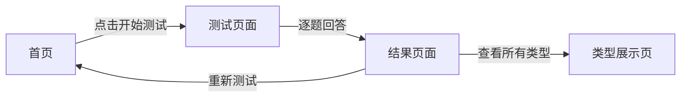

## 1. Product Overview
MBTI 性格测试网站，帮助用户快速了解自己的 MBTI 性格类型。
- 提供趣味化的 20 题性格测试，根据荣格心理学理论分析用户性格
- 面向所有对性格分析感兴趣的用户，提供专业且易懂的测试结果

## 2. Core Features

### 2.1 User Roles
| Role | Registration Method | Core Permissions |
|------|---------------------|------------------|
| Normal User | None (无需注册) | 完成测试、查看结果、重新测试 |

### 2.2 Feature Module
1. **首页**: 欢迎界面、测试说明、开始测试按钮
2. **测试页面**: 20道二选一问题、进度显示、上一题/下一题导航
3. **结果页面**: MBTI 类型展示、性格分析、优势劣势、适合职业

### 2.3 Page Details
| Page Name | Module Name | Feature description |
|-----------|-------------|---------------------|
| 首页 | Hero 区域 | 大标题、MBTI 介绍、开始测试按钮、渐变色背景 |
| 首页 | 说明卡片 | MBTI 简介、测试流程说明、图标展示 |
| 测试页 | 问题区域 | 大字体问题、2个选项按钮、选中状态样式 |
| 测试页 | 进度显示 | 进度条、当前题数/总题数、视觉反馈 |
| 结果页 | 类型展示 | 大字号 MBTI 类型、性格标签、色彩搭配 |
| 结果页 | 详细分析 | 性格描述、优势列表、劣势列表、适合职业 |
| 结果页 | 操作按钮 | 重新测试、分享结果、查看所有类型 |

## 3. Core Process
用户进入首页 → 点击开始测试 → 逐题回答20道问题 → 查看结果分析 → 可选择重新测试

## 4. User Interface Design
### 4.1 Design Style
- 主色调：紫色渐变 (#8B5CF6 到 #EC4899)，代表个性和心理学
- 辅助色：蓝色 (#3B82F6) 和绿色 (#10B981) 作为功能色
- 按钮风格：圆角矩形、悬浮效果、点击反馈
- 字体：现代无衬线字体 + 趣味展示字体
- 布局风格：卡片式、居中对齐、大量留白
- 整体风格：现代、趣味、专业、温暖

### 4.2 Page Design Overview
| Page Name | Module Name | UI Elements |
|-----------|-------------|-------------|
| 首页 | Hero 区域 | 渐变色背景、动画标题、跳动的 MBTI 字母、玻璃拟态按钮 |
| 首页 | 说明卡片 | 3列网格、彩色图标、简洁文字、悬浮动画 |
| 测试页 | 问题区域 | 大卡片、阴影效果、选项按钮对比色、选中高亮 |
| 测试页 | 进度条 | 顶部固定、平滑动画、百分比数字 |
| 结果页 | 类型展示 | 渐变色彩背景、大字号类型、性格标签、图标装饰 |
| 结果页 | 分析内容 | 分块展示、图标引导、文字排版优美 |

### 4.3 Responsiveness
- 移动端优先设计，完美适配手机、平板和桌面端
- 触摸优化的按钮尺寸（最小 44px）
- 自适应布局和字体大小

### 4.4 视觉效果
- 平滑的页面切换动画
- 有趣的微交互（按钮悬浮、点击反馈）
- 渐变色和动画背景
- 结果页的角色配色
